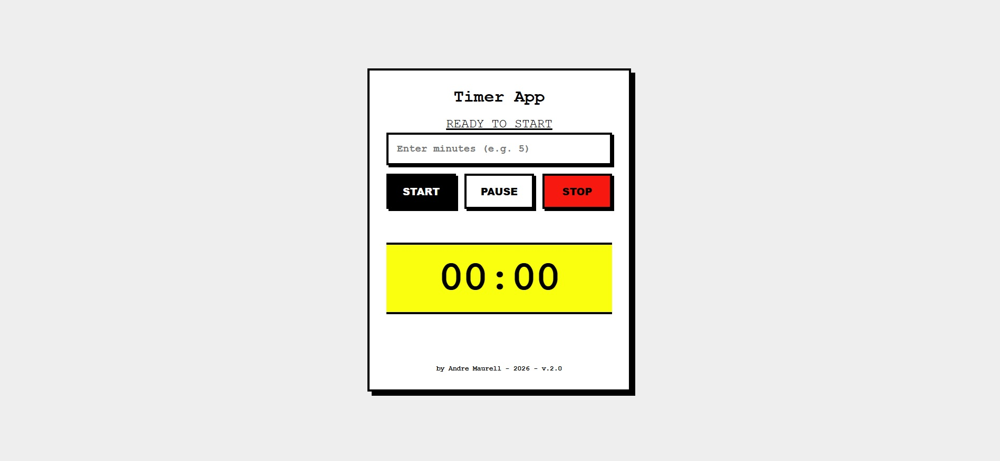

# Alarm / Timer App - v2.0

## 🇧🇷 Português

### Objetivo
O objetivo deste aplicativo é fornecer um temporizador (timer) simples, robusto e esteticamente marcante para uso diário. Ele foi projetado para ser **"Brutalista"**, priorizando a função, o alto contraste e uma aparência crua e industrial, evitando tendências modernas de design excessivamente suaves ("vibe code"). O foco é a utilidade imediata, estabilidade e uma experiência de usuário direta, sem distrações.

### Como foi Construído o Aplicativo
Este projeto foi completamente refatorado da versão 1.0 para aderir a padrões profissionais de engenharia de software, garantindo manutenibilidade e escalabilidade.

#### Tecnologias e Arquitetura
*   **Linguagens**: HTML5, CSS3, JavaScript (ES6+).
*   **Arquitetura**: MVC (Model-View-Controller). A lógica de negócio, a interface do usuário e o controle de interação estão estritamente separados.
*   **Design System**: "Neo-Brutalismo".
    *   Cores de alto contraste (Preto, Branco, Amarelo Neon).
    *   Ausência de bordas arredondadas (border-radius: 0).
    *   Sombras duras e sólidas.
    *   Tipografia Monospaced (Courier New).
    *   Layout responsivo e "No-Scroll" (travado na viewport para parecer um app nativo).

#### Princípios Aplicados
1.  **POO (Programação Orientada a Objetos)**: O código é organizado em classes (`Timer`, `TimerView`, `TimerController`, `Validator`), facilitando a reutilização e o encapsulamento.
2.  **SOLID**:
    *   **S (Single Responsibility)**: Cada classe tem uma única função (ex: `Validator` apenas valida, `Timer` apenas conta o tempo).
    *   **O (Open/Closed)**: O `Timer` emite eventos (`timer-update`), permitindo que a interface reaja a mudanças sem modificar a lógica interna do timer.
3.  **Componentização**: O código JavaScript foi separado em arquivos distintos (`utils`, `models`, `views`, `controllers`) e carregado ordenadamente para evitar dependências cíclicas e facilitar a leitura.
4.  **Segurança (OWASP)**:
    *   **Validação de Entrada**: O input aceita estritamente números. Tentativas de inserir letras são bloqueadas imediatamente via JavaScript.
    *   **Prevenção de XSS**: O uso de `textContent` ao invés de `innerHTML` previne injeção de scripts maliciosos.

---

## 🇺🇸 English

### Objective
The objective of this application is to provide a simple, robust, and aesthetically striking timer for daily use. It is designed to be **"Brutalist"**, prioritizing function, high contrast, and a raw, industrial look, avoiding overly soft modern design trends ("vibe code"). The focus is on immediate utility, stability, and a direct user experience without distractions.

### How It Was Built
This project was completely refactored from version 1.0 to adhere to professional software engineering standards, ensuring maintainability and scalability.

#### Technologies and Architecture
*   **Languages**: HTML5, CSS3, JavaScript (ES6+).
*   **Architecture**: MVC (Model-View-Controller). Business logic, user interface, and interaction control are strictly separated.
*   **Design System**: "Neo-Brutalism".
    *   High contrast colors (Black, White, Neon Yellow).
    *   No rounded corners (border-radius: 0).
    *   Hard, solid shadows.
    *   Monospaced typography (Courier New).
    *   Responsive "No-Scroll" layout (locked to viewport to feel like a native app).

#### Applied Principles
1.  **OOP (Object-Oriented Programming)**: Code is organized into classes (`Timer`, `TimerView`, `TimerController`, `Validator`), facilitating reuse and encapsulation.
2.  **SOLID**:
    *   **S (Single Responsibility)**: Each class has a single function (e.g., `Validator` only validates, `Timer` only counts time).
    *   **O (Open/Closed)**: The `Timer` emits events (`timer-update`), allowing the interface to react to changes without modifying the timer's internal logic.
3.  **Componentization**: JavaScript code was separated into distinct files (`utils`, `models`, `views`, `controllers`) and loaded in order to avoid cyclic dependencies and improve readability.
4.  **Security (OWASP)**:
    *   **Input Validation**: Input strictly accepts numbers. Attempts to enter letters are blocked immediately via JavaScript.
    *   **XSS Prevention**: Using `textContent` instead of `innerHTML` prevents malicious script injection.

---
**Version**: 2.0
**Author**: Andre Maurell
**Year**: 2026
